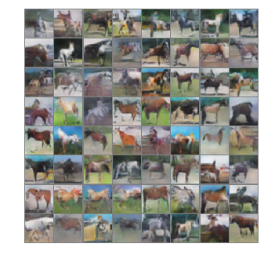
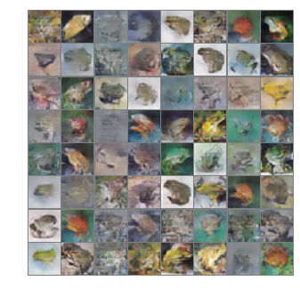
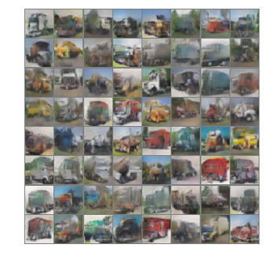

# ACGAN_cifar10
A PyTorch implementation of Auxiliary Classifier GAN to generate CIFAR10 images. 

## Literature survey

- The orginal ACGAN paper - [https://arxiv.org/abs/1610.09585]
- Code heavily inspired by <a href = "https://github.com/pytorch/examples/blob/master/dcgan/main.py">dcgan pytorch</a> repo. 
- A lot of tuning and hacks borrowed from <a href = "https://github.com/soumith/ganhacks">this</a> awesome repo.

## Results

- horses

- cars

- Frogs

- trucks

